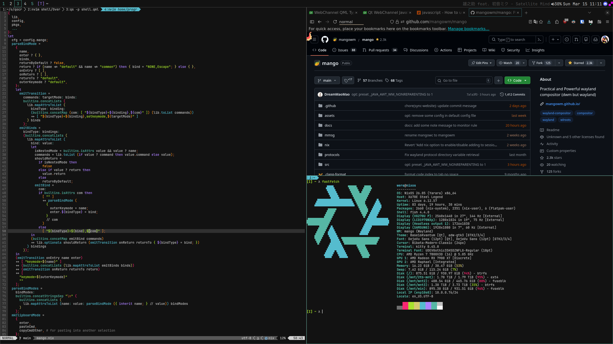
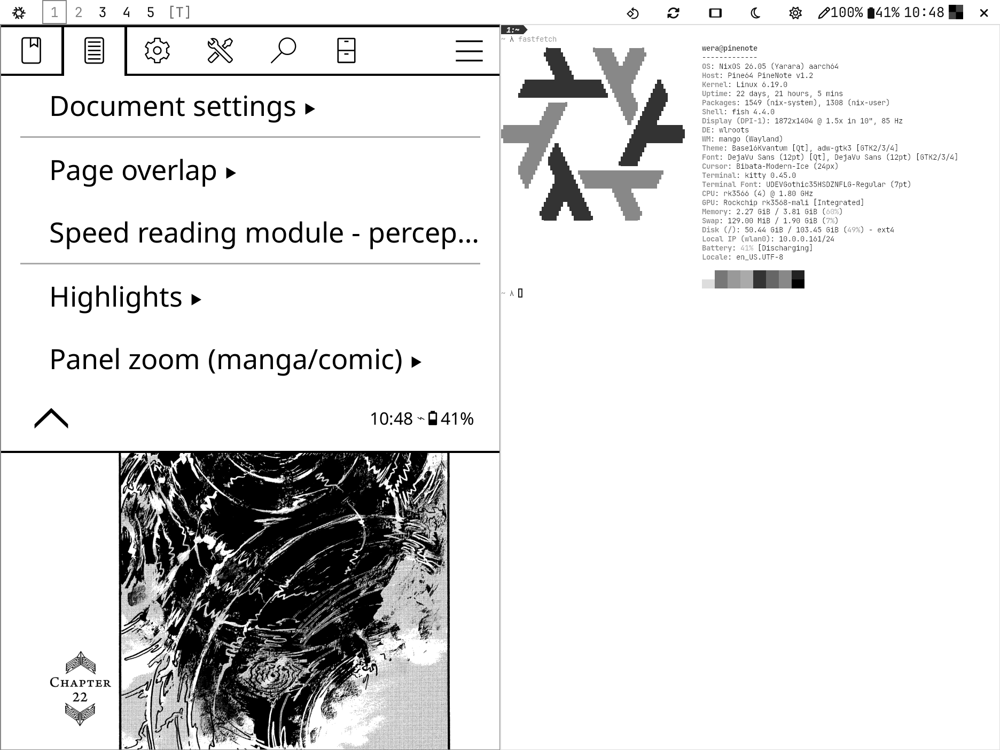

## nixos-config

### hosts

- **nixos** - primary `x86_64` desktop
- **nixos-laptop** - `x86_64` laptop
- **pinenote** - `arm64` PineNote e-ink tablet ([pinenote-nixos](https://github.com/WeraPea/pinenote-nixos))
- **server** - `x86_64` server (DNS, DHCP, Vaultwarden, Linkwarden, Samba for PS2 OPL)
- **fajita** - `arm64` OnePlus 6T (Mobile NixOS)

ARM64 targets can be built from x86_64 using cross-compilation + binfmt emulation. Rebuild/deployment commands are `fish` abbreviations in `home/programs/fish.nix`.

### programs

- **Compositor**: [mango](https://github.com/WeraPea/mangowc/tree/combined) (custom fork with overscan, zoom, tablet/touch support, dithering, touch gestures)
- **Bar**: quickshell
- **Browser**: glide (desktop), firefox (mobile)
- **Terminal**: kitty
- **Editor**: neovim (nixvim)
- **Shell**: fish
- **Media**: mpv
- **OCR**: [qocr](https://github.com/WeraPea/qocr) (Wayland overlay with Yomitan popup integration)
- **Music**: mpd + beets + cantata
- **Documents**: Zathura (desktop), KOReader (mobile)
- **Launcher**: rofi (desktop), quickshell (mobile)
- **File Manager**: yazi, oil.nvim
- **Input Method**: fcitx5 + mozc (Japanese), wvkbd (onscreen)
- **VR**: Monado (for Index)

### customizations

#### theming
- **Font**: UDEV Gothic 35HSDZNFLG (merged CJK/monospace)
- **Styling**: Stylix with molokai theme (grayscale on PineNote)
- **Browsers**: Custom userchrome CSS

#### overlays & custom derivations
- **PineNote tools**: [usb-tablet](https://github.com/WeraPea/pinenote-usb-tablet) helper, boot partition switcher, framebuffer screenshot tool
- **mpv scripts**: Anki card creation, YouTube subtitle conversion, mitmytproxy integration, progressbar
- **koreader**: Bundled with rakuyomi, anki-koplugin; patched for PineNote (screen refresh + pen bindings)
- **nyaasi**: rofi torrent search
- [OpenTabletDriver fork](https://github.com/WeraPea/OpenTabletDriver) - PineNote USB tablet support
- **beets-vocadb**: PURL tag support for Opus files
- **launch-osu**: Automated osu! fetching and scrobbler
- glide-browser: Extra prefs/policies support
- webtorrent-mpv-hook: P2P cutoff on completion
- **wvkbd**: Virtual keyboard with app blacklist

#### other
- dual-function keys (CapsLock/Meta via interception-tools)
- PipeWire Bluetooth prioritization and unlink mpv mpd volumes

### screenshots

### related projects
- [mangowc fork](https://github.com/WeraPea/mangowc)
- [qocr](https://github.com/WeraPea/qocr)
- [pinenote-nixos](https://github.com/WeraPea/pinenote-nixos)
- [pinenote-usb-tablet](https://github.com/WeraPea/pinenote-usb-tablet)
- [OpenTabletDriver fork](https://github.com/WeraPea/OpenTabletDriver)
